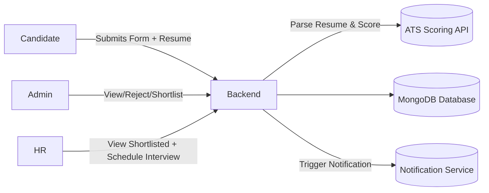

# 🗓️ Interview Scheduler System


A **role-based interview management system** that streamlines candidate tracking, shortlisting, and interview scheduling across different departments.  
Built with **React** (frontend) and **Spring Boot** (backend), this project connects **Candidates, HR, and Admins** through a clean, efficient workflow.

---

## ✨ Features

### 👩‍💼 Candidate
- Apply through a simple, responsive **form interface**
- Upload **resume** → automatically parsed by an **ATS Scoring API**
- Automatically **shortlisted** based on job description score threshold  

### 🧑‍💻 HR Panel
- View **shortlisted candidates**  
- **Manually schedule** interviews via a modal (date & time selector)
- Send **SMS or Call notifications** when respective buttons are clicked (not auto-triggered)
- View **scheduled slot details** after confirmation
- Once scheduled, the “Schedule” button disappears for that candidate  

### 👨‍💼 Admin Panel
- Access complete candidate database (applied, shortlisted, rejected)
- **Manually reject candidates**
- View parsed resume info and ATS scores

---

## 🧩 System Architecture



### 🏗️ Tech Stack

| Layer                 | Technology |
|-----------------------|------------|
| Frontend              | React.js, React Router, CSS Modules |
| Backend               | Spring Boot (Java), RESTful APIs |
| Database              | MongoDB |
| Queue & Notifications | RabbitMQ/Kafka (for retries), Twilio/Custom SMS API |
| Integration           | ATS Resume Parsing API |
| Design                | Matte finish, bluish-gray theme with glassmorphic UI |

---

### 🎨 UI Highlights
- 🩵 Sleek matte bluish-gray interface
- 💠 Glassy and minimal card-based layout
- 📅 Modal-based scheduling system
- 📱 Fully responsive for desktop and mobile
- 🌫️ Subtle gradients and visually pleasing alignment

---

### 📁 Folder Structure

```text
InterviewScheduler/
├── backend/
│   ├── src/
│   │   ├── main/java/com/interviewscheduler/
│   │   │   ├── controller/
│   │   │   ├── model/
│   │   │   ├── service/
│   │   │   └── repository/
│   │   └── resources/
│   └── pom.xml
│
├── frontend/
│   ├── src/
│   │   ├── components/
│   │   ├── pages/
│   │   ├── utils/
│   │   └── App.js
│   └── package.json
│
└── README.md
